# Chili Bullet Weapons

A Minecraft mod to add chili peppers, foods, and weapons.

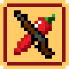 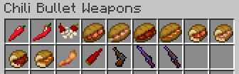

## Download Mod

- [Modrinth](https://modrinth.com/project/chili-bullet-weapons)
- [CurseForge](https://www.curseforge.com/minecraft/mc-mods/chili-bullet-weapons)

## How to Get Started

### 1. Obtain Curved Chili Pepper

Curved chili peppers can be obtained from breaking short grass.

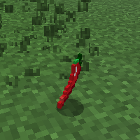

### 2. Craft Chili Pepper Seeds

Chili pepper seeds can be crafted from curved chili pepper.

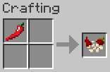

### 3. Grow Chili Pepper Crops

Chili pepper seeds can be placed on farmland by right-clicking, where they grow through eight stages.

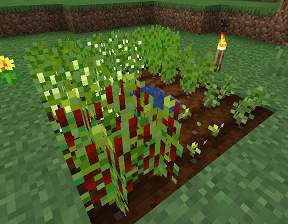

Breaking the final stage produces 1 to 3 curved chili peppers and 1 to 3 bullet-like chili peppers.

## Crop Farming

### Chili Pepper Seeds

Chili pepper seeds can be obtained from curved chili pepper that can be obtained by breaking short grass or mature chili pepper crops.

When extracting chili pepper seeds from a curved chili pepper, use a crafting table or the player's crafting grid.

### Chili Pepper Crops

Chili pepper seeds can be planted on farmland and the crops will grow to stage eight.

Different stages of crop growth:

| 1 | 2 | 3 | 4 | 5 | 6 | 7 | 8 |
|:-:|:-:|:-:|:-:|:-:|:-:|:-:|:-:|
||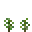|||||||

Chili peppers can be harvested from the crop in the final growth stage.

Items produced when crops are broken at each stage:

|Stage|Drop Items|Quantity|
|:---:|----------|:------:|
|1–7| Chili Pepper Seeds|1|
|8| Curved Chili Pepper   Bullet-like Chili Pepper|1–3 each|

If harvested with Fortune enchanted tool, the number of chili peppers dropped would increase.

### Composting

The following items can be added to a composter:

-  Chili Pepper Seeds
-  Curved Chili Pepper
-  Bullet-like Chili Pepper
- 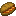 Chili Potato Sandwich
- 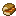 Half-sized Chili Potato Sandwich
-  Fried Chili Pepper

## Foods

### Sandwiches

Sandwiches can be crafted by combining curved chili pepper, cooked food, and bread.

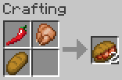

|Cooked Food|Sandwich|Quantity|
|-----------|--------|:------:|
|Cooked Chicken| Chili Chicken Sandwich|2|
|Cooked Cod| Chili Fish Sandwich|2|
|Cooked Salmon| Chili Fish Sandwich|2|
|Cooked Mutton|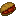 Chili Meat Sandwich|2|
|Cooked Porkchop| Chili Meat Sandwich|2|
|Cooked Rabbit| Chili Meat Sandwich|2|
|Steak| Chili Meat Sandwich|2|
|Baked Potato| Chili Potato Sandwich|2|

Each sandwich can be divided into two half-sized pieces by crafting.

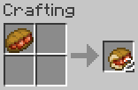

|Ingredient|Product|Quantity|
|----------|-------|:------:|
| Chili Chicken Sandwich| Half-sized Chili Chicken Sandwich|2|
| Chili Fish Sandwich| Half-sized Chili Fish Sandwich|2|
| Chili Meat Sandwich|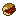 Half-sized Chili Meat Sandwich|2|
| Chili Potato Sandwich| Half-sized Chili Potato Sandwich|2|

### Fried Chili Pepper

A fried chili pepper can be crafted from curved chili peppers and wheat and gives Speed effect (0:30) when eaten by the player.

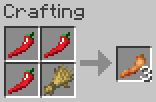

## Weapons

### Chili Bullet

A chili bullet serves as ammunition for chili bullet guns and can be crafted from a bullet-like chili pepper.

Chili bullets will disappear two seconds after they are fired.

### Chili Bullet Gun

A chili bullet gun is a break-action single-shot firearm that fires chili bullets to attack mobs at a distance.

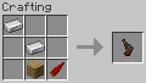

Chili bullet guns can be fired with the same operation as crossbows. Empty guns can be loaded by holding down the right mouse button, and loaded guns can be fired by right-clicking.

Chili bullet guns can have the same enchantments as crossbows, and each gun can have a different appearance and display name depending on the enchantment it has.

|Enchantment|Appearance (Closed/Open)|Display Name|
|-----------|:--------------------------:|------------|
|Piercing|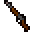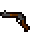|Chili Bullet Rifle|
|Multishot|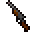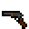|Chili Bullet Shotgun|
|Other than above|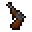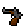|Chili Bullet Pistol|

Chili bullet rifles are highly accurate, and bullets from them pass through the number of entities equal to the Piercing level.

Chili bullet shotguns are less accurate, and they can fire four bullets in a single shot but also have four times the ammunition consumption and wear per shot.

---
© 2024 Iunius118
