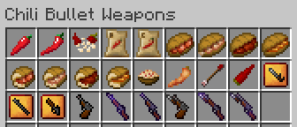

# Mod Description for Version 1.4.0

Chili Bullet Weapons is a Minecraft mod to add chili peppers, foods, and weapons.

## Download Mod

- [Modrinth](https://modrinth.com/project/chili-bullet-weapons)
- [CurseForge](https://www.curseforge.com/minecraft/mc-mods/chili-bullet-weapons)

## Descriptions

- [How to Get Started](v1/index.html)
- [Farming](v1/farming.html)
  - [Chili Pepper Seeds (CBW)](v1/farming.html#chili-pepper-seeds-cbw)
  - [Chili Pepper Crops (CBW)](v1/farming.html#chili-pepper-crops-cbw)
  - [Compact Storage of Chili Peppers](v1/farming.html#compact-storage-of-chili-peppers)
  - [Composting](v1/farming.html#composting)
- [Foods](v1/foods.html)
  - [Sandwiches](v1/foods.html#sandwiches)
  - [Half-sized Sandwiches](v1/foods.html#half-sized-sandwiches)
  - [Pasta Olio e Peperoncino](v1/foods.html#pasta-olio-e-peperoncino)
  - [Fried Chili Pepper](v1/foods.html#fried-chili-pepper)
- [Weapons](v1/weapons.html)
  - [Bullet Chili Arrow](v1/weapons.html#bullet-chili-arrow)
  - [Chili Bullet](v1/weapons.html#chili-bullet)
  - [Chili Bullet Gun](v1/weapons.html#chili-bullet-gun)
    - [Upgrading Guns](v1/weapons.html#upgrading-guns)
  - [Chili Bullet Gun with Bayonet](v1/weapons.html#chili-bullet-gun-with-bayonet)
  - [Chili Bullet Machine Gun (Creative Mode)](v1/weapons.html#chili-bullet-machine-gun-creative-mode)
- [Configuration](v1/config.html)
  - [Common](v1/config.html#common)
