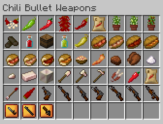

# Mod Description for Version 3.1.0

Chili Bullet Weapons is a Minecraft mod to add chili peppers, foods, and weapons.

## Download Mods

-  **CBW Chili Peppers and Foods**
  - [Modrinth](https://modrinth.com/mod/cbw-chili-peppers-and-foods)
  - [CurseForge](https://www.curseforge.com/minecraft/mc-mods/cbw-chili-peppers-and-foods)
-  **Chili Bullet Weapons**
  - [Modrinth](https://modrinth.com/project/chili-bullet-weapons)
  - [CurseForge](https://www.curseforge.com/minecraft/mc-mods/chili-bullet-weapons)

## Requirements

- NeoForge version - NeoForge
- Forge version - Minecraft Forge
- Fabric version - Fabric Loader, Fabric API, and Cloth Config API
- CBW Chili Peppers and Foods v2.2.0

## Table of Contents

- [How to Get Started](v3/index.html)

 CBW Chili Peppers and Foods

- [Farming](v3/farming.html)
  - [Chili Pepper Seeds (CBW)](v3/farming.html#chili-pepper-seeds-cbw)
  - [Chili Pepper Crops (CBW)](v3/farming.html#chili-pepper-crops-cbw)
  - [Drying Curved Chili Peppers](v3/farming.html#drying-curved-chili-peppers)
  - [Compact Storage of Chili Peppers](v3/farming.html#compact-storage-of-chili-peppers)
  - [Potted Chili Peppers](v3/farming.html#potted-chili-peppers)
  - [Chili Plant Biofuel](v3/farming.html#chili-plant-biofuel)
  - [Composting](v3/farming.html#composting)
- [Foods](v3/foods.html)
  - [Hot Chili Sauce](v3/foods.html#hot-chili-sauce)
  - [Barrel of Hot Chili Sauce](v3/foods.html#barrel-of-hot-chili-sauce)
  - [Green Hot Chili Sauce](v3/foods.html#green-hot-chili-sauce)
  - [Pickled Green Chili Pepper](v3/foods.html#pickled-green-chili-pepper)
  - [Sandwiches](v3/foods.html#sandwiches)
  - [Half-sized Sandwiches](v3/foods.html#half-sized-sandwiches)
  - [Pasta Olio e Peperoncino](v3/foods.html#pasta-olio-e-peperoncino)
  - [Fried Chili Pepper](v3/foods.html#fried-chili-pepper)
  - [Chili Chocolate](v3/foods.html#chili-chocolate)
  - [Chicken with Chili Chocolate Sauce](v3/foods.html#chicken-with-chili-chocolate-sauce)
- [Materials](v3/materials.html)
  - [Capsicum Crystal](v3/materials.html#capsicum-crystal)
  - [Fe-Cap Ingot](v3/materials.html#fe-cap-ingot)
  - [Fe-Cap Nugget](v3/materials.html#fe-cap-nugget)
  - [Block of Fe-Cap](v3/materials.html#block-of-fe-cap)
- [Tools](v3/tools.html)
  - [Fe-Cap Shovel](v3/tools.html#fe-cap-shovel)
  - [Fe-Cap Axe](v3/tools.html#fe-cap-axe)
  - [Fe-Cap Hoe](v3/tools.html#fe-cap-hoe)
  - [Fe-Cap Shears](v3/tools.html#fe-cap-shears)

 Chili Bullet Weapons

- [Weapons](v3/weapons.html)
  - [Bullet Chili Arrow](v3/weapons.html#bullet-chili-arrow)
  - [Chili Bullet](v3/weapons.html#chili-bullet)
  - [Chili Bullet Gun](v3/weapons.html#chili-bullet-gun)
    - [Upgrading Guns](v3/weapons.html#upgrading-guns)
    - [Mod Data Components for Guns](v3/weapons.html#mod-data-components-for-guns)
  - [Chili Bullet Machine Gun](v3/weapons.html#chili-bullet-machine-gun)
- [Configuration](v3/config.html)
  - [Common](v3/config.html#common)

### Older Versions

- [Version 1 for Minecraft 1.20.1-1.20.4](v1/index.html)
- [Version 2 for Minecraft 1.21.1](v2/index.html)
