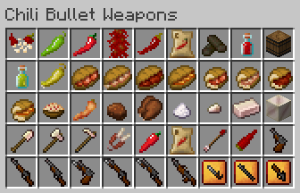

# Mod Description for Version 2.0.0

Chili Bullet Weapons is a Minecraft mod to add chili peppers, foods, and weapons.

## Download Mods

-  **CBW Chili Peppers and Foods**
  - [Modrinth](https://modrinth.com/mod/cbw-chili-peppers-and-foods)
  - [CurseForge](https://www.curseforge.com/minecraft/mc-mods/cbw-chili-peppers-and-foods)
-  **Chili Bullet Weapons**
  - [Modrinth](https://modrinth.com/project/chili-bullet-weapons)
  - [CurseForge](https://www.curseforge.com/minecraft/mc-mods/chili-bullet-weapons)

## Requirements

- NeoForge version - NeoForge
- Forge version - Minecraft Forge
- Fabric version - Fabric Loader, Fabric API, and Cloth Config API
- CBW Chili Peppers and Foods v1.2.0

## Table of Contents

- [How to Get Started](v2/index.html)

 CBW Chili Peppers and Foods

- [Farming](v2/farming.html)
  - [Chili Pepper Seeds (CBW)](v2/farming.html#chili-pepper-seeds-cbw)
  - [Chili Pepper Crops (CBW)](v2/farming.html#chili-pepper-crops-cbw)
  - [Drying Curved Chili Peppers](v2/farming.html#drying-curved-chili-peppers)
  - [Compact Storage of Chili Peppers](v2/farming.html#compact-storage-of-chili-peppers)
  - [Chili Plant Biofuel](v2/farming.html#chili-plant-biofuel)
  - [Composting](v2/farming.html#composting)
- [Foods](v2/foods.html)
  - [Hot Chili Sauce](v2/foods.html#hot-chili-sauce)
  - [Barrel of Hot Chili Sauce](v2/foods.html#barrel-of-hot-chili-sauce)
  - [Green Hot Chili Sauce](v2/foods.html#green-hot-chili-sauce)
  - [Pickled Green Chili Pepper](v2/foods.html#pickled-green-chili-pepper)
  - [Sandwiches](v2/foods.html#sandwiches)
  - [Half-sized Sandwiches](v2/foods.html#half-sized-sandwiches)
  - [Pasta Olio e Peperoncino](v2/foods.html#pasta-olio-e-peperoncino)
  - [Fried Chili Pepper](v2/foods.html#fried-chili-pepper)
  - [Chili Chocolate](v2/foods.html#chili-chocolate)
  - [Chicken with Chili Chocolate Sauce](v2/foods.html#chicken-with-chili-chocolate-sauce)
- [Materials](v2/materials.html)
  - [Capsicum Crystal](v2/materials.html#capsicum-crystal)
  - [Ferro-Capsicumium Ingot](v2/materials.html#ferro-capsicumium-ingot)
  - [Ferro-Capsicumium Nugget](v2/materials.html#ferro-capsicumium-nugget)
  - [Block of Ferro-Capsicumium](v2/materials.html#block-of-ferro-capsicumium)
- [Tools](v2/tools.html)
  - [Ferro-Capsicumium Shovel](v2/tools.html#ferro-capsicumium-shovel)
  - [Ferro-Capsicumium Axe](v2/tools.html#ferro-capsicumium-axe)
  - [Ferro-Capsicumium Hoe](v2/tools.html#ferro-capsicumium-hoe)
  - [Ferro-Capsicumium Shears](v2/tools.html#ferro-capsicumium-shears)

 Chili Bullet Weapons

- [Weapons](v2/weapons.html)
  - [Bullet Chili Arrow](v2/weapons.html#bullet-chili-arrow)
  - [Chili Bullet](v2/weapons.html#chili-bullet)
  - [Chili Bullet Gun](v2/weapons.html#chili-bullet-gun)
    - [Upgrading Guns](v2/weapons.html#upgrading-guns)
    - [Mod Data Components for Guns](v2/weapons.html#mod-data-components-for-guns)
  - [Chili Bullet Machine Gun](v2/weapons.html#chili-bullet-machine-gun)
- [Configuration](v2/config.html)
  - [Common](v2/config.html#common)

### For Older Version

- [Version 1 for Minecraft 1.20.1-1.20.4](v1/index.html)
