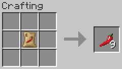
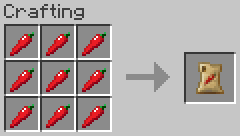
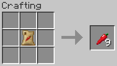

# Farming

- [Top Page](../index.html)
  - [How to Get Started](index.html)
  - **Farming**
    - [Chili Pepper Seeds (CBW)](#chili-pepper-seeds-cbw)
    - [Chili Pepper Crops (CBW)](#chili-pepper-crops-cbw)
    - [Compact Storage of Chili Peppers](#compact-storage-of-chili-peppers)
    - [Composting](#composting)
  - [Foods](foods.html)
  - [Weapons](weapons.html)
  - [Configuration](config.html)

## Chili Pepper Seeds (CBW)

Chili pepper seeds can be obtained from curved chili pepper that can be obtained by breaking short grass or mature chili pepper crops.

When extracting chili pepper seeds from a curved chili pepper, use a crafting table or the player's crafting grid.

## Chili Pepper Crops (CBW)

Chili pepper seeds can be planted on farmland and the crops will grow to stage eight.

Different stages of crop growth:

| 1 | 2 | 3 | 4 | 5 | 6 | 7 | 8 |
|:-:|:-:|:-:|:-:|:-:|:-:|:-:|:-:|
|||||||||

Chili peppers can be harvested from the crop in the final growth stage.

Items produced when crops are broken at each stage:

|Stage|Drop Items|Quantity|
|:---:|----------|:------:|
|1–7| Chili Pepper Seeds (CBW)|1|
|8| Curved Chili Pepper   Bullet-like Chili Pepper|1–3 each|

If harvested with Fortune enchanted tool, the number of chili peppers dropped would increase.

## Compact Storage of Chili Peppers

Sacks of chili peppers can be used to store chili peppers in a compact fashion.

Sack of Curved Chili Peppers  
 

Sack of Bullet-like Chili Peppers  
 

## Composting

The following items can be added to composters:

-  Chili Pepper Seeds (CBW)
-  Curved Chili Pepper
-  Bullet-like Chili Pepper
-  Chili Potato Sandwich
-  Half-sized Chili Potato Sandwich
-  Fried Chili Pepper
