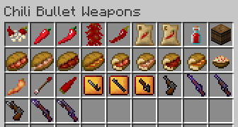

# Chili Bullet Weapons Version 1.5.2

Chili Bullet Weapons is a Minecraft mod to add chili peppers, foods, and weapons.

## Download Mod

- [Modrinth](https://modrinth.com/project/chili-bullet-weapons)
- [CurseForge](https://www.curseforge.com/minecraft/mc-mods/chili-bullet-weapons)

## Requirements

- Forge version - Minecraft Forge
- NeoForge version - NeoForge
- Fabric version - Fabric Loader, Fabric API, and Cloth Config API

## Table of Contents

- [How to Get Started](introduction.html)
- [Farming](farming.html)
  - [Chili Pepper Seeds (CBW)](farming.html#chili-pepper-seeds-cbw)
  - [Chili Pepper Crops (CBW)](farming.html#chili-pepper-crops-cbw)
  - [Drying Curved Chili Peppers](farming.html#drying-curved-chili-peppers)
  - [Compact Storage of Chili Peppers](farming.html#compact-storage-of-chili-peppers)
  - [Composting](farming.html#composting)
- [Foods](foods.html)
  - [Hot Chili Sauce](foods.html#hot-chili-sauce)
  - [Sandwiches](foods.html#sandwiches)
  - [Half-sized Sandwiches](foods.html#half-sized-sandwiches)
  - [Pasta Olio e Peperoncino](foods.html#pasta-olio-e-peperoncino)
  - [Fried Chili Pepper](foods.html#fried-chili-pepper)
- [Weapons](weapons.html)
  - [Bullet Chili Arrow](weapons.html#bullet-chili-arrow)
  - [Chili Bullet](weapons.html#chili-bullet)
  - [Chili Bullet Gun](weapons.html#chili-bullet-gun)
    - [Upgrading Guns](weapons.html#upgrading-guns)
  - [Chili Bullet Gun with Bayonet](weapons.html#chili-bullet-gun-with-bayonet)
  - [Chili Bullet Machine Gun (Creative Mode)](weapons.html#chili-bullet-machine-gun-creative-mode)
- [Configuration](config.html)
  - [Common](config.html#common)
