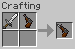
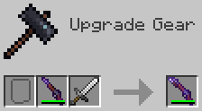

# Weapons

- [Top Page](../index.html)
  - [How to Get Started](index.html)
  - [Farming](farming.html)
  - [Foods](foods.html)
  - **Weapons**
    - [Chili Bullet](#chili-bullet)
    - [Chili Bullet Gun](#chili-bullet-gun)
    - [Chili Bullet Gun with Bayonet](#chili-bullet-gun-with-bayonet)
    - [Chili Bullet Machine Gun](#chili-bullet-machine-gun)

## Chili Bullet

A chili bullet serves as ammunition for chili bullet guns and can be crafted from a bullet-like chili pepper.

Chili bullets will disappear two seconds after they are fired.

## Chili Bullet Gun

A chili bullet gun is a break-action single-shot firearm that fires chili bullets to attack mobs at a distance.

Chili bullet guns can be fired with the same operation as crossbows. Specifically, unloaded guns can be loaded by holding down the right mouse button, and loaded guns can be fired by right-clicking.

Chili bullet guns can have the same enchantments as crossbows, and each gun can have a different appearance, display name, and performance depending on the enchantment it has.

|Enchantment|Appearance (Closed/Open)|Display Name|
|-----------|:--------------------------:|------------|
|Piercing||Chili Bullet Rifle|
|Multishot||Chili Bullet Shotgun|
|Other than above||Chili Bullet Pistol|

Chili bullet rifles are highly accurate, and bullets from them pass through the number of entities equal to the Piercing level.

Chili bullet shotguns are less accurate, and they can fire four bullets in a single shot but also have four times the ammunition consumption and wear per shot.

## Chili Bullet Gun with Bayonet

A chili bullet gun with bayonet is a chili bullet gun with an iron sword fitted and can deal 6 (♥ × 3) damage in melee combat.

Smithing tables can be used to make a chili bullet gun with bayonet retaining its enchantments.

Each chili bullet gun with bayonet can also have a different appearance, display name, and performance depending on the enchantment it has.

|Enchantment|Appearance (Closed/Open)|Display Name|
|-----------|:--------------------------:|------------|
|Piercing||Chili Bullet Rifle with Bayonet|
|Multishot||Chili Bullet Shotgun with Bayonet|
|Other than above||Chili Bullet Pistol with Bayonet|

## Chili Bullet Machine Gun

A chili bullet machine gun is a gun for creative mode players and can only be obtained from the creative mode tab or command.
