# Weapons

- [Top Page](../index.html)
  - [How to Get Started](index.html)
  - [Farming](farming.html)
  - [Foods](foods.html)
  - **Weapons**
    - [Bullet Chili Arrow](#bullet-chili-arrow)
    - [Chili Bullet](#chili-bullet)
    - [Chili Bullet Gun](#chili-bullet-gun)
      - [Upgrading Guns](#upgrading-guns)
    - [Chili Bullet Gun with Bayonet](#chili-bullet-gun-with-bayonet)
    - [Chili Bullet Machine Gun (Creative Mode)](#chili-bullet-machine-gun-creative-mode)
  - [Configuration](config.html)

See also: [Weapon Data](../weapon_data.html)

## Bullet Chili Arrow

|DANGER|
|:-:|
|💥 **EXPLOSIVE**|

A bullet chili arrow serves as ammunition for bows, crossbows, and dispensers.

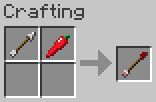

When a bullet chili arrow is shot and hits an entity or a block, it causes a small explosion, dealing explosive damage to nearby entities.

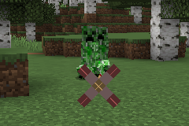
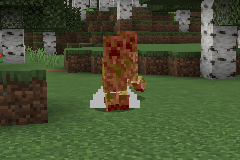

Power enchanted bows increase the explosive power and Multishot enchanted crossbows increase the number of bullet chili arrows shot.

## Chili Bullet

A chili bullet serves as ammunition for chili bullet guns and can be crafted from a bullet-like chili pepper.

Chili bullets will disappear two seconds after they are shot.

## Chili Bullet Gun

A chili bullet gun is a break-action single-shot gun that shoots chili bullets to attack mobs at a distance.

Chili bullet guns can be shot with the same operation as crossbows. Specifically, unloaded guns can be loaded by holding down the right mouse button, and loaded guns can be shot by right-clicking.

Chili bullet guns can have the same enchantments as crossbows, and each gun can have a different appearance, display name, and performance depending on the enchantment it has.

|Enchantment|Appearances (Closed/Open)|Display Name|
|-----------|:---------------------------:|------------|
|Piercing||Chili Bullet Rifle|
|Multishot||Chili Bullet Shotgun|
|Other than above||Chili Bullet Pistol|

Chili bullet rifles are highly accurate, and bullets from them pass through the number of entities equal to the Piercing level.

Chili bullet shotguns are less accurate, and they can shoot four bullets in a single shot but also have four times the ammunition consumption and wear per shot.

### Upgrading Guns

Chili bullet guns can be upgraded by using upgrade items.

To upgrade a chili bullet gun, follow these steps:

1. Hold a gun in the off-hand
2. Hold an upgrade item in the main hand
3. Use (right-click) the item in the main hand

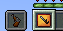
→
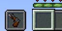

Currently, there are three types of upgrade items available.

-  Bayonet Upgrade
-  Gun Barrel Upgrade
-  Gun Mechanism Upgrade

Bayonet Upgrade  
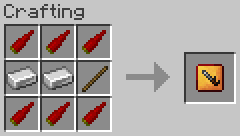

A bayonet upgrade is an item to upgrade a chili bullet gun to a chili bullet gun with bayonet.

Gun Barrel Upgrade  
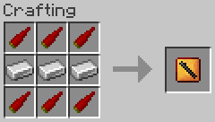

A gun barrel upgrade gives Piercing II to a gun without Piercing and Multishot to a gun with Piercing IV.

Gun Mechanism Upgrade  
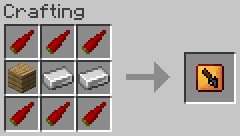

A gun mechanism upgrade gives Quick Charge I to a gun without Quick Charge.

## Chili Bullet Gun with Bayonet

A chili bullet gun with bayonet is a chili bullet gun with a bayonet fitted and can deal 6 (♥ × 3) damage in melee combat.

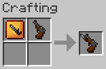

Bayonet upgrade items can be used to make a chili bullet gun with bayonet retaining the enchantments.

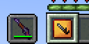
→
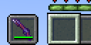

Each chili bullet gun with bayonet can also have a different appearance, display name, and performance depending on the enchantment it has.

|Enchantment|Appearances (Closed/Open)|Display Name|
|-----------|:---------------------------:|------------|
|Piercing|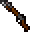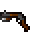|Chili Bullet Rifle with Bayonet|
|Multishot|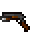|Chili Bullet Shotgun with Bayonet|
|Other than above|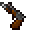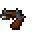|Chili Bullet Pistol with Bayonet|

## Chili Bullet Machine Gun (Creative Mode)

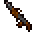

A chili bullet machine gun is a gun for creative mode players and can only be obtained from the creative mode tab or command.
