# Foods

Chili Bullet Weapons Version 2.0.0, and CBW Chili Peppers and Foods Version 1.2.0

- [Top Page](../index.html)
  - [How to Get Started](index.html)
-  CBW Chili Peppers and Foods
  - [Farming](farming.html)
  - **Foods**
    - [Hot Chili Sauce](#hot-chili-sauce)
    - [Barrel of Hot Chili Sauce](#barrel-of-hot-chili-sauce)
    - [Green Hot Chili Sauce](#green-hot-chili-sauce)
    - [Pickled Green Chili Pepper](#pickled-green-chili-pepper)
    - [Sandwiches](#sandwiches)
    - [Half-sized Sandwiches](#half-sized-sandwiches)
    - [Pasta Olio e Peperoncino](#pasta-olio-e-peperoncino)
    - [Fried Chili Pepper](#fried-chili-pepper)
    - [Chili Chocolate](#chili-chocolate)
    - [Chicken with Chili Chocolate Sauce](#chicken-with-chili-chocolate-sauce)
  - [Materials](materials.html)
  - [Tools](tools.html)
-  Chili Bullet Weapons
  - [Weapons](weapons.html)
  - [Configuration](config.html)

## Hot Chili Sauce

Hot chili sauce is a hot sauce made from curved chili peppers and can be used to flavor food.

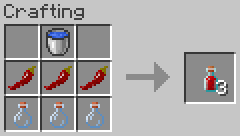

Glass bottles will be returned when hot chili sauce is consumed by crafting.

Hot chili sauce can be thrown by using it.
It splashes on impact and applies Slowness IV and Blindness effects (0:02) to nearby entities.

## Barrel of Hot Chili Sauce

A barrel of hot chili sauce can be used to make many bottles of hot chili sauce at one time.

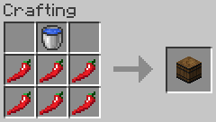

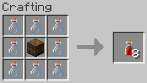

## Green Hot Chili Sauce

Green hot chili sauce is a hot sauce made from curved green chili peppers and can be used to flavor food.

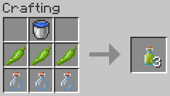

Glass bottles will be returned when hot chili sauce is consumed by crafting.

Green hot chili sauce can be thrown by using it.
It splashes on impact and applies Slowness IV and Blindness effects (0:02) to nearby entities.

## Pickled Green Chili Pepper

A pickled green chili pepper is a pickled curved green chili pepper that can be used as an ingredient or eaten directly.

A pickled green chili pepper gives Absorption I effect (0:30) when eaten by the player.

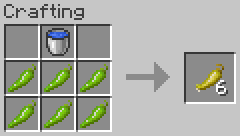

## Sandwiches

Sandwiches can be crafted by combining curved chili pepper, cooked food, and bread.
Hot chili sauce can also be used in place of curved chili pepper.

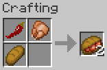
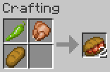
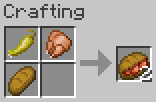
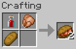
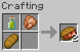

|Cooked Food|Sandwich|Quantity|
|-----------|--------|:------:|
|Cooked Chicken| Chili Chicken Sandwich|2|
|Cooked Cod| Chili Fish Sandwich|2|
|Cooked Salmon| Chili Fish Sandwich|2|
|Cooked Mutton| Chili Meat Sandwich|2|
|Cooked Porkchop| Chili Meat Sandwich|2|
|Cooked Rabbit| Chili Meat Sandwich|2|
|Steak| Chili Meat Sandwich|2|
|Baked Potato| Chili Potato Sandwich|2|

## Half-sized Sandwiches

Each sandwich can be divided into two half-sized pieces by crafting.

|Ingredient|Product|Quantity|
|----------|-------|:------:|
| Chili Chicken Sandwich| Half-sized Chili Chicken Sandwich|2|
| Chili Fish Sandwich| Half-sized Chili Fish Sandwich|2|
| Chili Meat Sandwich| Half-sized Chili Meat Sandwich|2|
| Chili Potato Sandwich| Half-sized Chili Potato Sandwich|2|

## Pasta Olio e Peperoncino

Pasta olio e peperoncino is a dish of pasta cooked in salted water, tossed with oil and crushed chili peppers, and served in a bowl. This dish is really simple and poor, but it will prevent starvation.

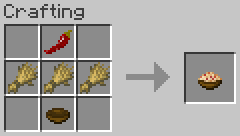
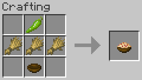
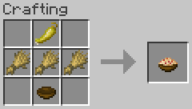

## Fried Chili Pepper

A fried chili pepper can be crafted from curved chili peppers and wheat and gives Speed I effect (0:30) when eaten by the player.

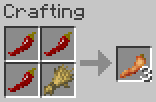
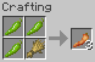
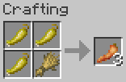

## Chili Chocolate

Chili Chocolate is chocolate flavored with dried curved chili pepper and gives Haste I effect (0:30) when eaten by the player.

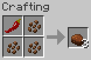

## Chicken with Chili Chocolate Sauce

Chicken with chili chocolate sauce is cooked chicken braised in sauce of chili chocolate.

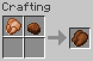
