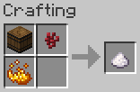
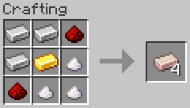
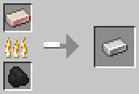
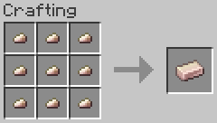
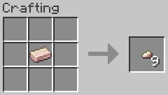
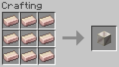
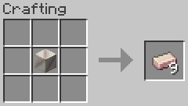

# Materials

Chili Bullet Weapons Version 2.0.0, and CBW Chili Peppers and Foods Version 1.2.0

- [Top Page](../index.html)
  - [How to Get Started](index.html)
-  CBW Chili Peppers and Foods
  - [Farming](farming.html)
  - [Foods](foods.html)
  - **Materials**
    - [Capsicum Crystal](#capsicum-crystal)
    - [Ferro-Capsicumium Ingot](#ferro-capsicumium-ingot)
    - [Ferro-Capsicumium Nugget](#ferro-capsicumium-nugget)
    - [Block of Ferro-Capsicumium](#block-of-ferro-capsicumium)
  - [Tools](tools.html)
-  Chili Bullet Weapons
  - [Weapons](weapons.html)
  - [Configuration](config.html)

## Capsicum Crystal

Capsicum crystal is a crystalline component of chili peppers, a substance extracted from chili peppers with alcohol and dried.

## Ferro-Capsicumium Ingot

Ferro-capsicumium is an alloy consisting of iron and curved chili pepper components with redstone as catalyst.

Ferro-capsicumium ingots can be smelted in a furnace or blast furnace to obtain iron ingots.

## Ferro-Capsicumium Nugget

Ferro-capsicumium nuggets are pieces of ferro-capsicumium.

## Block of Ferro-Capsicumium

Block of ferro-capsicumium can be used to store ferro-capsicumium ingots in a compact fashion.

Block of ferro-capsicumium can be harvested when broken with a pickaxe with stone or higher mining level.
