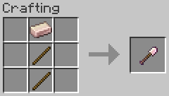
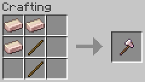
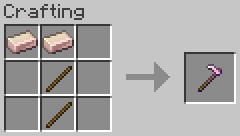
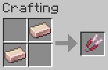

# Tools

Chili Bullet Weapons Version 2.0.0, and CBW Chili Peppers and Foods Version 1.3.0

- [Top Page](index.html)
  - [How to Get Started](introduction.html)
-  CBW Chili Peppers and Foods
  - [Farming](farming.html)
  - [Foods](foods.html)
  - [Materials](materials.html)
  - **Tools**
    - [Fe-Cap Shovel](#fe-cap-shovel)
    - [Fe-Cap Axe](#fe-cap-axe)
    - [Fe-Cap Hoe](#fe-cap-hoe)
    - [Fe-Cap Shears](#fe-cap-shears)
-  Chili Bullet Weapons
  - [Weapons](weapons.html)
  - [Configuration](config.html)

## Fe-Cap Shovel

A Fe-Cap shovel is a tool made from ferro-capsicumium and can be used like an iron shovel.

## Fe-Cap Axe

A Fe-Cap axe is a tool made from ferro-capsicumium and can be used like an iron axe.

## Fe-Cap Hoe

A Fe-Cap hoe is a tool made from ferro-capsicumium and can be used like an iron hoe.

## Fe-Cap Shears

Fe-Cap shears are tools made from ferro-capsicumium and can be used like shears.

When chili pepper crops are harvested by using Fe-Cap shears, chili pepper seeds will automatically be sown.
