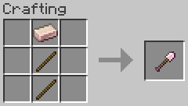

# Tools

Chili Bullet Weapons Version 2.0.0, and CBW Chili Peppers and Foods Version 1.2.0

- [Top Page](../index.html)
  - [How to Get Started](index.html)
-  CBW Chili Peppers and Foods
  - [Farming](farming.html)
  - [Foods](foods.html)
  - [Materials](materials.html)
  - **Tools**
    - [Ferro-Capsicumium Shovel](#ferro-capsicumium-shovel)
    - [Ferro-Capsicumium Axe](#ferro-capsicumium-axe)
    - [Ferro-Capsicumium Hoe](#ferro-capsicumium-hoe)
    - [Ferro-Capsicumium Shears](#ferro-capsicumium-shears)
-  Chili Bullet Weapons
  - [Weapons](weapons.html)
  - [Configuration](config.html)

## Ferro-Capsicumium Shovel

A ferro-capsicumium shovel is a tool made from ferro-capsicumium and can be used like an iron shovel.

## Ferro-Capsicumium Axe

A ferro-capsicumium axe is a tool made from ferro-capsicumium and can be used like an iron axe.

## Ferro-Capsicumium Hoe

A ferro-capsicumium hoe is a tool made from ferro-capsicumium and can be used like an iron hoe.

## Ferro-Capsicumium Shears

Ferro-capsicumium shears are tools made from ferro-capsicumium and can be used like shears.

When chili pepper crops are harvested by using ferro-capsicumium shears, chili pepper seeds will automatically be sown.
