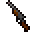
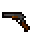
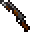
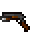
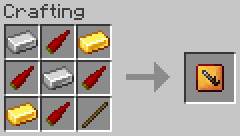
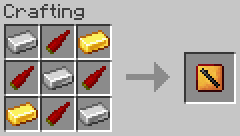
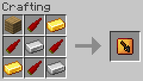
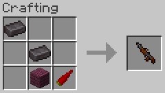
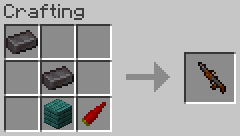

# Weapons

Chili Bullet Weapons Version 2.0.0, and CBW Chili Peppers and Foods Version 1.1.1

- [Top Page](../index.html)
  - [How to Get Started](index.html)
-  CBW Chili Peppers and Foods
  - [Farming](farming.html)
  - [Foods](foods.html)
  - [Materials](materials.html)
  - [Tools](tools.html)
-  Chili Bullet Weapons
  - **Weapons**
    - [Bullet Chili Arrow](#bullet-chili-arrow)
    - [Chili Bullet](#chili-bullet)
    - [Chili Bullet Gun](#chili-bullet-gun)
      - [Upgrading Guns](#upgrading-guns)
      - [Mod Data Components for Guns](#mod-data-components-for-guns)
    - [Chili Bullet Machine Gun](#chili-bullet-machine-gun)
  - [Configuration](config.html)

See also: [Weapon Data](weapon_data.html)

## Bullet Chili Arrow

|DANGER|
|:-:|
|💥 **EXPLOSIVE**|

A bullet chili arrow serves as ammunition for bows, crossbows, and dispensers.

When a bullet chili arrow is shot and hits an entity or a block, it causes a small explosion, dealing explosive damage to nearby entities.

Power enchanted bows increase the explosive power and Multishot enchanted crossbows increase the number of bullet chili arrows shot.

## Chili Bullet

A chili bullet serves as ammunition for chili bullet guns and can be crafted from a bullet-like chili pepper.

Chili bullets will disappear two seconds after they are shot.

When a chili bullet hits an entity, there is a 10% chance of a critical hit.

## Chili Bullet Gun

A chili bullet gun is a break-action single-shot gun that shoots chili bullets to attack mobs at a distance.

Chili bullet guns can be shot with the same operation as crossbows.
Specifically, unloaded guns can be loaded by holding down the right mouse button, and loaded guns can be shot by right-clicking.

The following enchantments can be applied to chili bullet guns:

- Unbreaking
- Mending
- Curse of Vanishing

A chili bullet gun is named Chili Bullet Pistol when crafted, but the display name and appearance may change with upgrades.

|Display Name|Appearances (Closed/Open)|Upgrades|
|------------|:---------------------------:|--------|
|Chili Bullet Pistol||(No upgrades)|
|Chili Bullet Rifle|| Gun Barrel Upgrade|
|Chili Bullet Volley Gun|| Gun Barrel Upgrade x2|
|Chili Bullet Pistol with Bayonet|| Bayonet Upgrade|
|Chili Bullet Rifle with Bayonet|| Bayonet Upgrade,  Gun Barrel Upgrade|
|Chili Bullet Volley Gun with Bayonet|| Bayonet Upgrade,  Gun Barrel Upgrade x2|

A chili bullet rifle is highly accurate and powerful, and a bullet from it pass through three entities.

A chili bullet volley gun is less accurate, and it can fire four bullets in a single shot but also have four times the ammunition consumption and wear per shot.

A chili bullet gun with bayonet is a chili bullet gun with a bayonet fitted and can deal 6 (♥ × 3) damage in melee combat.

A chili bullet gun with custom name will have a reduced chance of durability reduction.

### Upgrading Guns

Chili bullet guns can be upgraded by using upgrade items.

To upgrade a chili bullet gun, follow these steps:

1. Hold a gun in the off-hand
2. Hold an upgrade item in the main hand
3. Use (right-click) the item in the main hand

→

Currently, there are three types of upgrade items available.

-  Bayonet Upgrade
-  Gun Barrel Upgrade
-  Gun Mechanism Upgrade

Bayonet Upgrade  

A bayonet upgrade is an item to upgrade a gun to a gun with bayonet.

Gun Barrel Upgrade  

A gun barrel upgrade is an item to upgrade a pistol to a rifle and a rifle to a volley gun.

Gun Mechanism Upgrade  

A gun mechanism upgrade is an item to decrease loading time of a gun.
This upgrade can be used up to three times per gun.

### Mod Data Components for Guns

This mod adds some data components to save the state of the chili bullet gun.
The following is a description of the main data components among them.

#### `chilibulletweapons:gun_contents`

- Contains upgrade data of a gun
  - **`quick_loading`** - Number of loading time upgrades (non-negative integer, default is `0`)
  - **`piercing`** - Number of entities bullet can penetrate (integer between 0 and 5, default is `0`)
  - **`barrel_count`** - Number of barrel (integer between 1 and 4, default is `1`)
  - **`show_in_tooltip`** - Whether to show upgrade data in the tooltip (boolean, default is `true`)

#### `chilibulletweapons:bayoneted`

- If set, this gun is fitted with a bayonet
- Has a float value representing the bayonet attack damage

#### `chilibulletweapons:fixed`

- If set, this gun cannot be upgraded with upgrade items

#### `chilibulletweapons:dyed_gun_colors`

- Contains colors of a gun
  - **`metal_rgb`** - Color of metal parts (integer in RGB24 format, default is `16777215`)
  - **`wood_rgb`** - Color of wooden parts (integer in RGB24 format, default is `16777215`)
  - **`blade_rgb`** - Color of bayonet blade (integer in RGB24 format, default is `16777215`)
  - **`show_in_tooltip`** - Whether to show color values in the tooltip (boolean, default is `true`)
- If set, a special model is used to dye the gun

#### Examples of Data Component Usage

The data components described above can be used for commands or recipes.

A command example:

    /give @p chilibulletweapons:gun[chilibulletweapons:gun_contents={quick_loading:5,piercing:1,barrel_count:2},chilibulletweapons:bayoneted=5f,chilibulletweapons:fixed={},chilibulletweapons:dyed_gun_colors={metal_rgb:3355443,wood_rgb:10027008,blade_rgb:16764108},minecraft:custom_name='"Unguis Accipitris"',minecraft:enchantments={levels:{"minecraft:vanishing_curse":1}}]

\*Note that this command is too long for chat and should be executed by command block.

A recipe example:

    {
      "type": "minecraft:crafting_shaped",
      "category": "equipment",

      /* Define ingredients and pattern here */

      "result": {
        "components": {
          "chilibulletweapons:gun_contents": {
            "quick_loading": 5,
            "piercing": 1,
            "barrel_count": 2
          },
          "chilibulletweapons:bayoneted": 5.0,
          "chilibulletweapons:fixed": {},
          "chilibulletweapons:dyed_gun_colors": {
            "metal_rgb": 3355443,
            "wood_rgb": 10027008,
            "blade_rgb": 16764108
          },
          "minecraft:custom_name": "\"Unguis Accipitris\"",
          "minecraft:enchantments": {
            "levels": {
              "minecraft:vanishing_curse": 1
            }
          }
        },
        "count": 1,
        "id": "chilibulletweapons:gun"
      }
    }

## Chili Bullet Machine Gun

A chili bullet machine gun is an automatic gun that shoots chili bullets to attack mobs at a distance.

A chili bullet machine gun can resist fire and lava when dropped as an item.

A chili bullet machine gun can be loaded with the first bullet by holding down the right mouse button, and then the right mouse button can be used to shoot until the inventory runs out of bullets.

The following enchantments can be applied to chili bullet machine gun:

- Unbreaking
- Mending
- Curse of Vanishing

In survival mode, Unbreaking and Mending enchantments are highly recommended, as chili bullet machine gun is not durable!

A chili bullet machine gun with custom name will have a reduced chance of durability reduction.

Chili bullet machine gun cannot be upgraded with any upgrade items.
