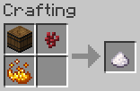
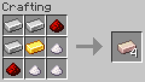
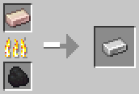
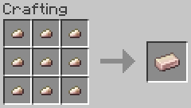
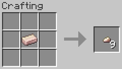
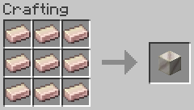
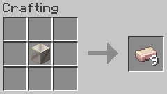

# Materials

Chili Bullet Weapons Version 3.1.0, and CBW Chili Peppers and Foods Version 2.2.0

- [Top Page](../index.html)
  - [How to Get Started](index.html)
-  CBW Chili Peppers and Foods
  - [Farming](farming.html)
  - [Foods](foods.html)
  - **Materials**
    - [Capsicum Crystal](#capsicum-crystal)
    - [Fe-Cap Ingot](#fe-cap-ingot)
    - [Fe-Cap Nugget](#fe-cap-nugget)
    - [Block of Fe-Cap](#block-of-fe-cap)
  - [Tools](tools.html)
-  Chili Bullet Weapons
  - [Weapons](weapons.html)
  - [Configuration](config.html)

## Capsicum Crystal

Capsicum crystal is a crystalline component of chili peppers, a substance extracted from chili peppers with alcohol and dried.

## Fe-Cap Ingot

Ferro-capsicumium (Fe-Cap) is an alloy consisting of iron and curved chili pepper components with redstone as catalyst.

Fe-Cap ingots can be smelted in a furnace or blast furnace to obtain iron ingots.

## Fe-Cap Nugget

Fe-Cap nuggets are pieces of ferro-capsicumium.

## Block of Fe-Cap

Block of Fe-Cap can be used to store Fe-Cap ingots in a compact fashion.

Block of Fe-Cap can be harvested when broken with a pickaxe with stone or higher mining level.
